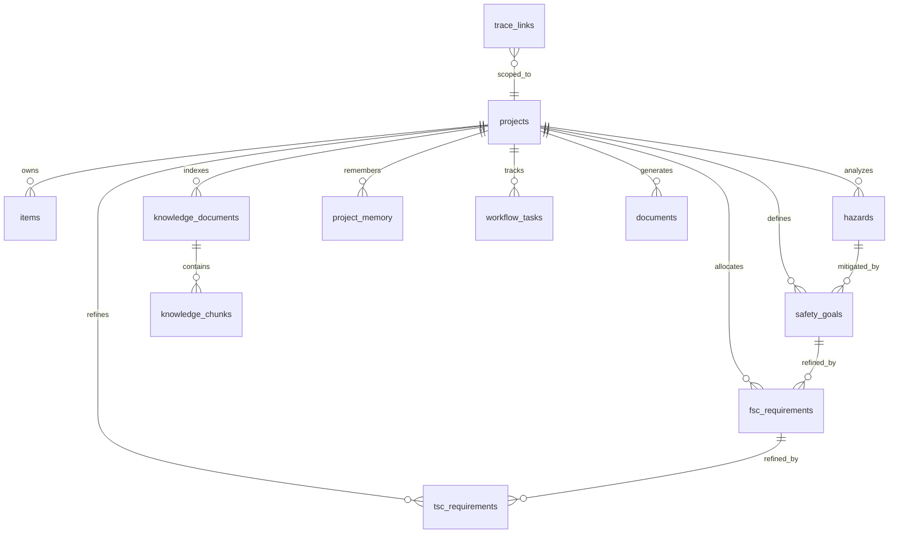

# Database Schema

The canonical schema is implemented in `fusa_ai_studio/database/schema.sql`.

All artifacts include timestamps. AI interactions record provider, model, prompt, retrieved context, and response for traceability.
