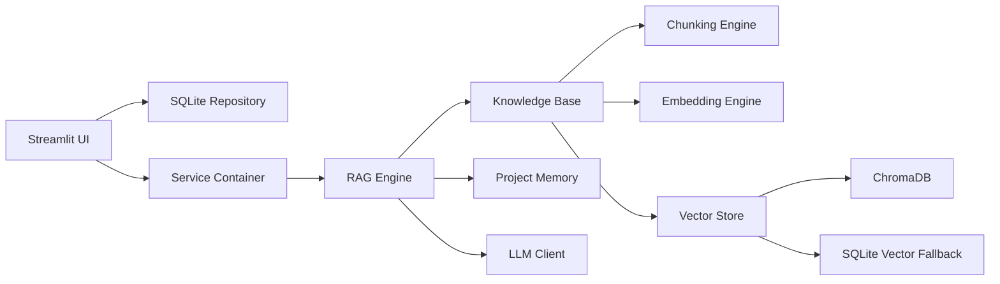
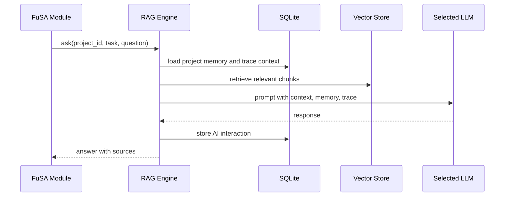

# Dependency Diagrams

## Runtime

```mermaid
flowchart LR
    UI[Streamlit UI] --> Repo[SQLite Repository]
    UI --> Services[Service Container]
    Services --> RAG[RAG Engine]
    RAG --> KB[Knowledge Base]
    RAG --> Memory[Project Memory]
    RAG --> LLM[LLM Client]
    KB --> Chunking[Chunking Engine]
    KB --> Embedding[Embedding Engine]
    KB --> Vector[Vector Store]
    Vector --> Chroma[ChromaDB]
    Vector --> SQLite[SQLite Vector Fallback]
```

## AI Requirement

```mermaid
sequenceDiagram
    participant Module as FuSA Module
    participant RAG as RAG Engine
    participant Repo as SQLite
    participant VS as Vector Store
    participant LLM as Selected LLM
    Module->>RAG: ask(project_id, task, question)
    RAG->>Repo: load project memory and trace context
    RAG->>VS: retrieve relevant chunks
    RAG->>LLM: prompt with context, memory, trace
    LLM-->>RAG: response
    RAG->>Repo: store AI interaction
    RAG-->>Module: answer with sources
```
